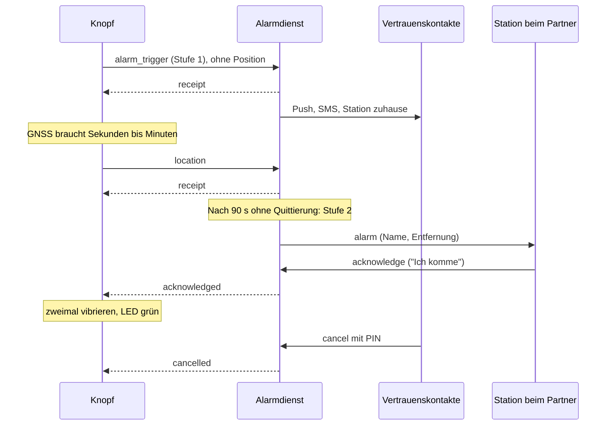

# Architektur

## Der Weg eines Alarms



Drei Dinge daran sind Absicht:

**Der Alarm geht vor der Position raus.** Auf einen GNSS-Fix zu warten würde Sekunden bis
Minuten kosten. Die Position kommt nach.

**Die Quittierung geht zurück ans Gerät.** Das ist laut Businessplan die emotional wertvollste
Funktion des Systems und kostet in der Herstellung nichts.

**Beendet wird ein Alarm nur mit PIN.** Eine Quittierung heißt „jemand kommt", nicht „vorbei".

## Bausteine

| Ort                       | Was                                       | Sprache             |
| ------------------------- | ----------------------------------------- | ------------------- |
| `apps/backend`            | Alarmdienst und API-Dienst                | TypeScript, NestJS  |
| `apps/web`                | Landingpage und Nachfragetest             | TypeScript, Next.js |
| `apps/mobile`             | App für Kontakte                          | Dart, Flutter       |
| `firmware/button`         | Knopf                                     | C                   |
| `firmware/station`        | Station                                   | C                   |
| `packages/shared-types`   | Fachbegriffe und Konstanten               | TypeScript          |
| `packages/protocols`      | Gerät ↔ Backend (binär + JSON), auch in C | TypeScript + C      |
| `packages/api-contracts`  | App/Web ↔ Backend                         | TypeScript, zod     |
| `infrastructure/database` | Schema als SQL                            | SQL                 |

## Zwei Dienste statt einem

`apps/backend` enthält zwei Einstiegspunkte, die getrennt betrieben werden:

- `main.alarm.ts` — Uplink vom Knopf, Stationen, Hochstufung, Quittierung, Entwarnung
- `main.api.ts` — Warteliste, später Shop, Konten, Partnerverwaltung

Der Alarmdienst hängt an keinem Modul des API-Dienstes. Ein Fehler im Shop darf einen Alarm
nicht aufhalten. Begründung: `entscheidungen/0002-alarmpfad-getrennt.md`.

## Wie der Alarmdienst innen aufgebaut ist

```
UplinkController ─┐
AlarmController  ─┼─▶ AlarmService ─┬─▶ AlarmDispatcher ─▶ Kanäle (Log/Push/SMS, Station)
StationController┘                  └─▶ Speicher-Schnittstellen (ports.ts)
                                            ├─ memory/   (Entwicklung, Tests)
                                            └─ postgres/ (Betrieb)
```

`AlarmService` ist eine gewöhnliche Klasse ohne Datenbankwissen. Deshalb prüfen die Tests in
`alarm.service.spec.ts` die 90-Sekunden-Regel in Millisekunden und ohne Docker.

## Zeitgeber überleben keinen Neustart

Die Hochstufung nach 90 Sekunden läuft **nicht** über `setTimeout` pro Alarm, sondern über
einen Rundlauf alle fünf Sekunden über die Datenbank (`escalation.scheduler.ts`). Ein Neustart
des Dienstes mitten in einem Alarm würde sonst genau die Hochstufung verlieren, auf die es
ankommt. Dieselbe Mechanik löscht stündlich abgelaufene Standortdaten.

## Was noch fehlt

- Anmeldung für App-Nutzer. Die Endpunkte sind heute nur durch die nicht erratbare Alarm-Kennung
  geschützt; die Entwarnung zusätzlich durch die PIN.
- Push und SMS. Es gibt die Schnittstelle `NotificationChannel` und einen Kanal, der ins Log
  schreibt. Anbieter und iOS-Berechtigung stehen in `roadmap.md`.
- Partnerverwaltung, Shop, Bestellung.
